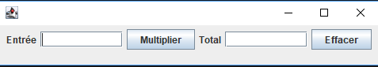

# Ouvrir [BigBlob](BigBlob/),  sous BLUEJ : menu 'projet' item 'Ouvrir'.

## Création de l'interface simple



Voici un bout de code qui permettrait de la créée

```java
//... éléments de l'interface
    protected JTextField m_totalTf     = new JTextField(10);
    protected JTextField m_userInputTf = new JTextField(10);
    private JButton    m_multiplyBtn = new JButton("Multiplier");
    private JButton    m_clearBtn    = new JButton("Effacer");
    private JLabel    m_entreeL = new JLabel("Entrée");
    private JLabel    m_totalL    = new JLabel("Total");

    JPanel content = new JPanel(new FlowLayout());

    /** Constructor */
    MultGUI() {
        content.add(m_entreeL);
        content.add(m_userInputTf);
        content.add(m_multiplyBtn);
        content.add(m_totalL);
        content.add(m_totalTf);
        content.add(m_clearBtn);
        //... finalize layout
        this.setContentPane(content);
        this.pack();      
    } 
```

### Verifier que vous obtenez le résultat voulu

introduction du calcul dans cette même classe : pour les grands entiers Java propose java.math.BigInteger. Etudier cette classe...

Pour déclencher le calcul on va attacher au bouton 'Multiplier'  un MultiplicationListener qui implémente l'interface 'ActionListener' dont la méthode actionPerfomed aura le code suivant

