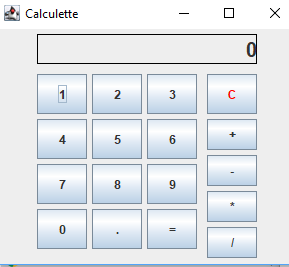

# nfp121.ed3

Exercices dirigé (en mode travaux pratique) MVC programmation événementielle

# créez une calculatrice

Ah ! Ça faisait longtemps… Un petit ED/TP ! Dans celui-ci, nous allons - enfin, vous allez - pouvoir réviser tout ce qui a été vu concernant ces parties :

* les fenêtres ;
* les conteneurs ;
* les boutons ;
* les interactions ;
* les classes internes ;

L'objectif est ici de réaliser une petite calculatrice basique. qui aura cet aspect

